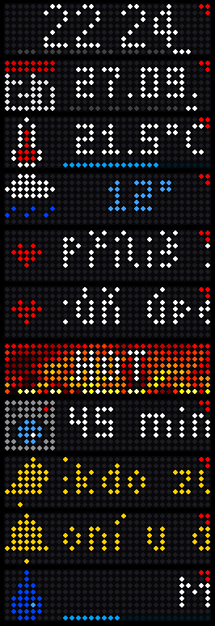
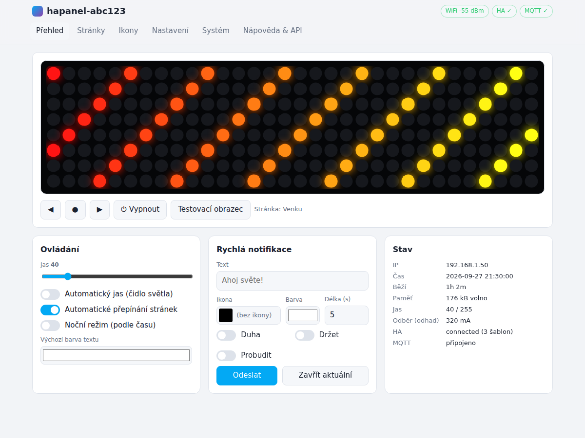
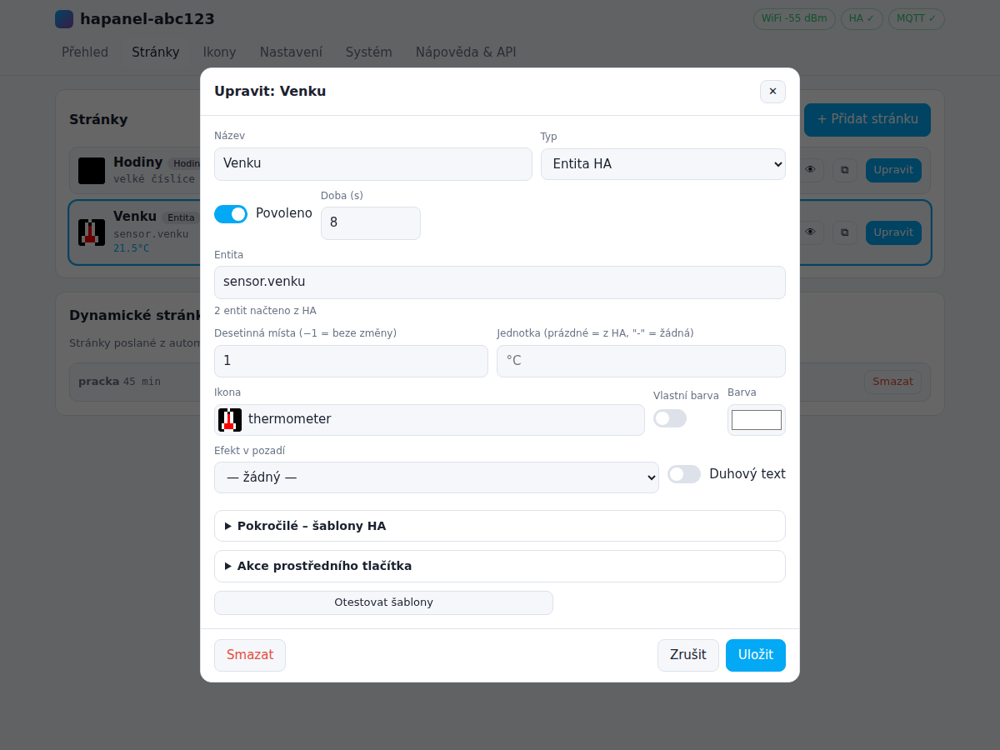
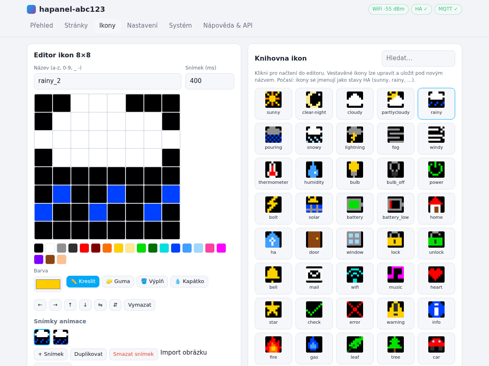
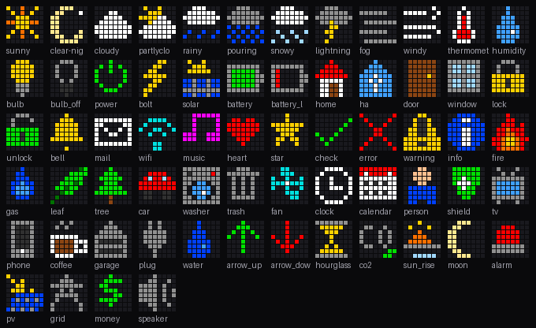
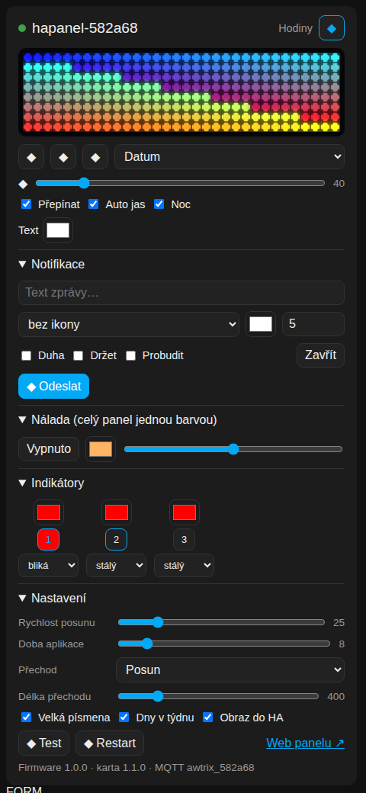

# HA-Panel – LED matice 8×32 pro Home Assistant

Vlastní firmware pro ESP32, který z levného flexibilního panelu **8×32 WS2812B** udělá
chytrý displej pro Home Assistant. Používá **stejné zapojení jako AWTRIX 3** (matice na GPIO32)
a má **AWTRIX 3 kompatibilní MQTT/HTTP API** – stávající AWTRIX automatizace a blueprinty fungují
beze změny. Navíc umí číst data přímo z HA (šablony Jinja vyhodnocované živě), má vlastní webové
rozhraní v češtině, stránky s entitami a ikonami, editor ikon a MQTT auto-discovery.

## Přechod z AWTRIX 3

- **Zapojení se nemění**: matice GPIO32, tlačítka GPIO26 / 27 / 14, fotorezistor GPIO35.
  Nahraj `firmware/hapanel-esp32-factory.bin` (ESP32) nebo `hapanel-ulanzi-tc001-factory.bin` (Ulanzi).
- **Rozložení matice** jako AWTRIX `"matrix": 0/1/2` – *Nastavení → Matice → Předvolba*.
  Výchozí je 0 (řádky, had), stejně jako v AWTRIX.
- **MQTT prefix** je `awtrix_xxxxxx` (poslední 3 bajty MAC, stejně jako AWTRIX), takže
  automatizace posílající do `awtrix_xxxxxx/notify`, `/custom/<app>`, `/indicator1` … fungují dál.
- **HTTP**: `/api/notify`, `/api/custom?name=`, `/api/indicator1-3`, `/api/power`, `/api/moodlight`,
  `/api/switch`, `/api/nextapp`, `/api/previousapp`, `/api/settings`, `/api/stats`, `/api/loop`,
  `/api/screen`, `/api/notify/dismiss`, `/api/reboot`.
- **Podporované klíče zpráv**: `text` (i barevné fragmenty), `icon`, `color`, `background`, `gradient`,
  `rainbow`, `blinkText`, `fadeText`, `textCase`, `topText`, `textOffset`, `center`, `noScroll`,
  `scrollSpeed`, `repeat`, `duration`, `hold`, `wakeup`, `stack`, `progress`, `progressC`, `progressBC`,
  `bar`, `line`, `autoscale`, `barBC`, `draw` (dp, dl, dr, df, dc, dfc, dt, db), `effect`, `lifetime`,
  `lifetimeMode`, pole aplikací.
- **Ikony podle LaMetric ID** (např. `"icon": "2400"`): na záložce *Ikony* zadej ID a klikni
  *Stáhnout z LaMetric* – ikona (i animovaná) se uloží pod stejným číslem.
- Není podporováno: zvuky (buzzer, DFPlayer), baterie, teplotní čidla, MQTT placeholdery `{{topic}}`
  (místo nich použij šablony HA na stránkách).

```
 ┌────────────────────────────────┐
 │ ☀  21.5°   ▮▮ ▮▮ ▮▮ ▮▮ ▮▮ ▮▮ ▮▮ │  ← ikona + hodnota z HA + pruh dní
 └────────────────────────────────┘
```

## Náhled

| Displej (simulace skutečného vykreslování firmwaru) | Webové rozhraní |
|---|---|
|  |  |




Vestavěné ikony:



## Funkce

**Displej**
- Stránky, které se automaticky střídají: **hodiny** (malé i velké číslice, pruh dní v týdnu),
  **datum** (ikona kalendáře s dnešním dnem), **entita HA**, **šablona HA**, **text**, **efekt**
- 64 vestavěných ikon 8×8 (i animovaných). Ikony počasí se jmenují jako stavy HA
  (`sunny`, `rainy`, `partlycloudy`…), takže šablona `{{ states('weather.home') }}` rovnou vybere ikonu
- Vlastní font 3×5 **s českou diakritikou** (á č ď é ě í ň ó ř š ť ú ů ý ž), ° ² ³ €
- Plynulý posun dlouhého textu, přechody (posun, prolínání), 9 efektů (duha, oheň, plasma,
  matrix, sníh, jiskření, vlny, polární záře, hvězdy) i jako pozadí stránky
- 3 **indikátory** na pravém okraji (např. otevřené okno = červená tečka)
- Noční režim (čas od–do, snížený jas, jen hodiny, přebarvení)
- Automatický jas z fotorezistoru, plynulé změny jasu
- **Omezovač proudu** (odhad odběru, nepřetíží zdroj ani USB)

**Home Assistant**
- Přímé připojení na **WebSocket API** HA (token). Hodnoty se nepollují – panel odebírá
  šablony (`render_template`) a změna se zobrazí okamžitě
- Každá stránka může mít šablony pro **text, barvu, ikonu, viditelnost a průběh** (pruh 0–100 %)
  → např. „zobraz pračku jen když pere, s pruhem zbývajícího času“
- Prostřední tlačítko může na aktuální stránce **přepnout entitu** nebo **zavolat službu**
- **MQTT auto-discovery**: zařízení v HA se světlem (zap/vyp, jas, barva, efekty), výběrem stránky,
  přepínači, tlačítky, entitou `notify`, senzory (RSSI, proud, okolní světlo), tlačítky panelu
- **Notifikace** s ikonou, barvou, duhou, opakováním, „držet do potvrzení“, probuzením displeje
- **Dynamické stránky** posílané z automatizací (s dobou platnosti)

**Webové rozhraní** (česky, funguje i na mobilu)
- Živý náhled displeje, ovládání, rychlá notifikace
- Správa stránek s předvolbami (počasí, teplota, spotřeba, FVE, baterie, pračka, CO₂, …),
  našeptávač entit z HA a **testování šablon** přímo v editoru
- **Editor ikon** 8×8 (kreslení, výplň, kapátko, animace až 8 snímků, import PNG, export)
- Nastavení Wi-Fi (vyhledání sítí), HA, MQTT, matice (s testovacím obrazcem), času, noci,
  tlačítek, indikátorů, hesla
- OTA aktualizace firmwaru, záloha/obnova (JSON), tovární nastavení
- Při prvním spuštění vlastní Wi-Fi AP s captive portálem

## Jakou desku použít

| Deska | Doporučení |
|---|---|
| **ESP32 DevKit (ESP32-WROOM-32)** se zapojením AWTRIX | ⭐ **Výchozí.** Stejná deska a zapojení jako AWTRIX 3 DIY (matice GPIO32). Dvě jádra – displej běží na vlastním jádře. |
| Ulanzi TC001 (hodiny AWTRIX) | ✅ Prostředí `ulanzi-tc001` – nahradí AWTRIX, využije čidlo světla i tlačítka. |
| ESP32-S3 | ✅ Funguje (data GPIO14). Pozor na desky se dvěma USB – viz *Řešení problémů*. |
| ESP32-C3 (SuperMini) | ⚠️ Funguje, ale má jen jedno jádro – při síťové aktivitě může animace drobně zaškobrtnout. |
| ESP8266 / ESP32-S2 | ❌ Nepodporováno (málo RAM / jedno jádro). |

## Zapojení

### Varianta A – napájení přes desku (jako u WLED, nejjednodušší)

```
  USB nabíječka 5 V ══ USB kabel ══ ESP32 deska
                                     │
                    pin 5V / VIN ────┼──────────────── +5V  (červený) panelu
                    pin GND ─────────┼──────────────── GND  (bílý/černý) panelu
                    GPIO32 ── 330 Ω ─┴──────────────── DIN  (zelený) panelu
                    (ESP32 / Ulanzi: GPIO32 jako AWTRIX, S3: GPIO14, C3: GPIO5 – lze změnit ve webu)

  Volitelně (jako AWTRIX 3 DIY):
  Tlačítka: GPIO26 (vlevo), GPIO27 (střed), GPIO14 (vpravo) ── tlačítko ── GND
  Fotorezistor GL5516: 3V3 ── LDR ──┬── GPIO35
                                    └── 10 kΩ ── GND
```

- Firmware má z výroby **limit proudu 850 mA** (stejně jako WLED), takže USB konektor, kabel
  ani dráhy desky se nepřetíží. Displej zobrazující text a ikony se do tohoto limitu vejde
  s rezervou – omezení se projeví jen u celoplošných efektů při vysokém jasu (automaticky ztmaví).
- Volbu najdeš v *Nastavení → Matice → Napájení panelu* (USB z počítače 450 mA,
  nabíječka 850 mA, silná nabíječka 1500 mA). Víc než ~1 A přes desku nedoporučuji –
  některé desky mají na 5V větvi ochrannou diodu nebo tenké dráhy.
- Použij kvalitní krátký USB kabel a nabíječku alespoň 5 V/2 A.
- Kondenzátor 470–1000 µF mezi +5V a GND u panelu je vhodný i zde (vyhladí špičky).

### Varianta B – externí zdroj (pro vyšší jas / efekty)

```
  Zdroj 5 V / 4 A ──┬─────────────────────── +5V  (červený) panelu
                    │        ┌── 1000 µF ──┐
  GND ──────────────┼────────┴─────────────┴─ GND  (bílý/černý) panelu
                    │
                    ├── 5V / VIN desky ESP32   (nebo napájet ESP32 z USB, GND ale VŽDY spojit!)
                    │
  ESP32 GPIO32 ── 330 Ω ─────────────────────── DIN  (zelený) panelu
  (ESP32 / Ulanzi: GPIO32, S3: GPIO14, C3: GPIO5 – lze změnit ve webu)
```

Poznámky:
- Panel 8×32 má 256 LED; při plném bílém jasu by bral až **15 A**. Omezovač proudu nastav
  podle zdroje (*Nastavení → Matice → Napájení panelu*), např. 3500 mA pro zdroj 4 A.
- U této varianty veď napájení panelu **přímo ze zdroje**, ne přes desku. Kondenzátor 1000 µF
  na vstupu panelu a rezistor 330 Ω v datovém vodiči chrání první LED.
- Datový signál 3,3 V obvykle stačí. Pokud panel bliká nebo zobrazuje nesmysly, přidej převodník
  úrovní **74AHCT125** (nebo SN74AHCT1G125) na 5 V.

## Nahrání firmwaru

### A) Hotový soubor – bez instalace čehokoliv
Ve složce [`firmware/`](firmware/) jsou připravené obrazy:

| Soubor | Deska |
|---|---|
| `hapanel-esp32-factory.bin` | **ESP32 DevKit / WROOM-32 se zapojením AWTRIX (GPIO32)** |
| `hapanel-ulanzi-tc001-factory.bin` | Ulanzi TC001 |
| `hapanel-esp32-s3-factory.bin` | jakákoli ESP32-S3 deska (data GPIO14) |
| `hapanel-esp32-c3-factory.bin` | ESP32-C3 (data GPIO5) |

1. Otevři v Chrome/Edge <https://espressif.github.io/esptool-js/> (nebo <https://web.esphome.io> → *Install* → vlastní soubor)
2. Připoj desku USB kabelem, *Connect*, vyber port
3. Nahraj `*-factory.bin` na adresu **0x0** a spusť *Program*
   (u S3 případně podrž tlačítko BOOT při připojení)

Soubory `*-ota.bin` slouží pro pozdější aktualizaci přes webové rozhraní (*Systém → Aktualizace*).

### B) PlatformIO (vývoj)
```bash
pip install platformio
pio run -e esp32 -t upload           # nebo ulanzi-tc001 / esp32-s3 / esp32-c3
pio device monitor
```
Webové rozhraní (`web/index.html`) se při sestavení automaticky zkomprimuje do firmwaru
(`tools/embed_web.py`). Další aktualizace lze posílat po síti:
`pio run -e esp32 -t upload --upload-port hapanel-xxxxxx.local`.

## První spuštění

1. Po zapnutí panel vytvoří Wi-Fi síť **`HA-Panel-xxxxxx`**, heslo **`hapanel1`**
   (údaje se zároveň posouvají na displeji).
2. Po připojení se otevře nastavovací stránka (nebo jdi na <http://192.168.4.1>).
3. *Nastavení → Wi-Fi*: vyber síť, zadej heslo, ulož a restartuj. Panel ukáže svou novou IP adresu;
   web je pak dostupný i na `http://hapanel-xxxxxx.local`.
4. *Nastavení → Matice*: stiskni **Testovací obrazec** – červená LED musí být vlevo nahoře,
   zelená vpravo nahoře. Pokud ne, zkus předvolby *AWTRIX rozložení 0 / 1 / 2* (flexibilní panel
   8×32 bývá rozložení 2 – sloupce), případně volby *první LED vpravo / dole*.

## Propojení s Home Assistantem

### 1. Čtení dat z HA (doporučeno)
1. V HA: *Profil → Zabezpečení → Dlouhodobé přístupové tokeny → Vytvořit token*
2. Na panelu: *Nastavení → Home Assistant* → zapnout, URL (`http://homeassistant.local:8123`
   nebo IP), vložit token, uložit. Ve hlavičce se objeví **HA ✓**.
3. *Stránky → Přidat stránku* → vyber předvolbu, např. *Venkovní teplota*, uprav entitu
   (našeptávač nabídne entity z HA), tlačítkem **Otestovat šablony** hned uvidíš výsledek.

### 2. Ovládání panelu z HA (MQTT)
Potřebuješ MQTT broker (doplněk *Mosquitto broker* + integrace *MQTT*).
Na panelu *Nastavení → MQTT* vyplň broker a uživatele. Díky auto-discovery se v HA objeví
zařízení **hapanel-xxxxxx** s entitami (ID entit začínají `hapanel_xxxxxx_`, přesné ID najdeš v HA u zařízení):

| Entita | Použití |
|---|---|
| `light.*_displej` | zap/vyp, jas, výchozí barva textu, efekty (oheň, duha…) |
| `light.*_nalada` | nálada – celý panel jednou barvou (barva + jas) |
| `light.*_indikator_1..3` | indikátory v rohu (barva, efekt stálý / bliká / pulzuje) |
| `select.*_stranka` | přepnout na stránku |
| `select.*_prechod` | typ přechodu mezi stránkami |
| `switch.*` | automatické přepínání, automatický jas, noční režim, velká písmena, pruh dní, obraz do HA |
| `number.*` | jas, rychlost posunu textu, doba zobrazení aplikace, délka přechodu |
| `button.*` | další / předchozí stránka, akce stránky, zavřít notifikaci, testovací obrazec, restart |
| `notify.*_notifikace` | posílání zpráv (`notify.send_message`) |
| `text.*_zprava` | rychlá zpráva – co napíšeš, to se zobrazí |
| `sensor.*_aplikace` | právě zobrazená stránka; atributy: MQTT prefix, IP, verze, seznam ikon a stránek |
| `image.*_obrazovka` | živý obraz displeje (zapni přepínačem „Obraz do Home Assistantu“) |
| `sensor.*` | Wi-Fi signál, doba běhu, odhad proudu, okolní světlo |
| `binary_sensor.*_tlacitko_*` | fyzická tlačítka (pro automatizace) |

### 3. Karta do dashboardu (`hapanel-card`)



Karta ukazuje živý náhled displeje a umí vše ovládat: zapnutí, jas, přepínání a výběr stránky,
notifikace s ikonou a barvou, náladu, indikátory i nastavení (rychlost posunu, doba zobrazení,
přechody, velká písmena, pruh dní). Má vizuální editor.

Instalace:
1. Zkopíruj [`ha/hapanel-card.js`](ha/hapanel-card.js) do HA do složky `/config/www/`
   (např. doplňkem *File editor* nebo *Samba*).
   Pokud HA běží na `http://` (ne https), můžeš místo kopírování použít přímo adresu panelu
   `http://<IP-panelu>/hapanel-card.js`.
2. *Nastavení → Řídicí panely → ⋮ → Zdroje → Přidat zdroj*: URL `/local/hapanel-card.js`,
   typ *JavaScript modul*. Obnov stránku (Ctrl+F5).
3. Na dashboardu *Přidat kartu → HA-Panel LED matice* a vyber entitu `light.…_displej`. Nebo YAML:
   ```yaml
   type: custom:hapanel-card
   entity: light.hapanel_xxxxxx_displej
   title: LED panel
   notify_open: true        # volitelné; dále show_preview / show_controls / show_notify /
                            # show_mood / show_indicators / show_settings: false
   ```
4. Pro živý náhled zapni v kartě *Nastavení → Obraz do HA* (panel pak posílá obraz jen když se změní;
   entitu `image.…_obrazovka` doporučuji vyřadit z recorderu, viz níže).

```yaml
# configuration.yaml – neukládat obraz do historie
recorder:
  exclude:
    entity_globs:
      - image.*_obrazovka
```

### 4. Blueprint pro notifikace z automatizací
[`ha/blueprints/hapanel_notify.yaml`](ha/blueprints/hapanel_notify.yaml) – importuj
(*Nastavení → Automatizace → Blueprinty → Importovat* s URL souboru na GitHubu, nebo zkopíruj do
`/config/blueprints/script/`), vytvoř z něj skript a zadej MQTT prefix panelu. Pak v automatizacích:
```yaml
action: script.panel_notifikace
data:
  message: "Pračka dokončila"
  icon: washer
  color: [0, 255, 0]
  duration: 8
  wakeup: true
```

### Příklady automatizací

Zpráva při zazvonění:
```yaml
action: notify.send_message
target:
  entity_id: notify.hapanel_xxxxxx_notifikace
data:
  message: "Někdo zvoní!"
```

Plná notifikace přes MQTT (ikona, barva, opakování, probuzení vypnutého displeje):
```yaml
action: mqtt.publish
data:
  topic: awtrix_xxxxxx/notify
  payload: >
    {"text": "Pračka dokončila", "icon": "washer", "color": "#00ff00",
     "repeat": 2, "wakeup": true}
```

Dynamická stránka z automatizace (zmizí po 10 minutách):
```yaml
action: mqtt.publish
data:
  topic: awtrix_xxxxxx/custom/myčka
  payload: '{"text": "Myčka {{ states(''sensor.mycka_zbyva'') }} min", "icon": "water", "progress": 60, "lifetime": 600}'
```

Indikátor (blikající červená vpravo nahoře):
```yaml
action: mqtt.publish
data:
  topic: awtrix_xxxxxx/indicator1
  payload: '{"color": "#ff0000", "blink": 500}'
```

Bez MQTT – přes REST (`configuration.yaml`):
```yaml
rest_command:
  hapanel_notify:
    url: "http://192.168.1.50/api/notify"
    method: POST
    content_type: "application/json"
    payload: '{"text": "{{ text }}", "icon": "{{ icon | default(''bell'') }}"}'
```

### Užitečné šablony pro stránky
```jinja
{{ states('sensor.venku_teplota') | float | round(1) }}°                         ← text
{{ states('weather.forecast_home') }}                                            ← ikona počasí
{{ '#ff4000' if states('sensor.spotreba')|float(0) > 3000 else '#ffffff' }}      ← barva
{{ is_state('binary_sensor.pracka', 'on') }}                                     ← viditelnost
{{ state_attr('sensor.telefon', 'battery_level') }}                              ← průběh 0–100
{{ 'bulb' if is_state('light.obyvak', 'on') else 'bulb_off' }}                   ← ikona dle stavu
```

## Tlačítka (volitelná)
| Tlačítko | Krátký stisk | Dlouhý stisk |
|---|---|---|
| vlevo | předchozí stránka | jas − |
| střed | akce stránky (toggle / služba) nebo zavřít notifikaci | displej vyp/zap |
| vpravo | další stránka | jas + |

## HTTP API (výběr)
| Požadavek | Popis |
|---|---|
| `POST /api/notify` | notifikace (JSON jako u MQTT) |
| `POST /api/custom?name=x` / `DELETE` | dynamická stránka |
| `POST /api/indicator?n=1` | indikátor |
| `POST /api/control` | `{"power":true,"brightness":80,"next":true,"page":"Hodiny"}` |
| `GET /api/status`, `/api/config`, `/api/pages` | stav a konfigurace |
| `GET /api/frame` | aktuální obraz (RGB bajty) |
| `POST /api/update` | OTA (multipart) |

Kompletní přehled je v aplikaci na záložce **Nápověda & API**.

## Struktura projektu
```
platformio.ini         prostředí pro S3 / ESP32 / C3 / Ulanzi
src/main.cpp           start, hlavní smyčka, vykreslovací úloha (50 fps)
src/apps.*             stránky, notifikace, přechody, indikátory, noční režim
src/display.*          plátno, font s diakritikou, mapování matice, jas, omezovač proudu
src/icons*.{h,cpp}     vestavěné + vlastní ikony (LittleFS)
src/effects.*          animované efekty
src/ha_client.*        Home Assistant WebSocket (render_template) + REST
src/mqtt.*             MQTT + auto-discovery
src/awtrix.*           AWTRIX 3 kompatibilní API (stats, settings, power, moodlight…)
src/web.*              webový server, REST API, živý náhled (WebSocket)
src/hw.*               Wi-Fi/AP/mDNS/NTP, tlačítka, čidlo světla
src/config.*           konfigurace (JSON v LittleFS)
web/index.html         webové rozhraní (vloží se do firmwaru)
ha/hapanel-card.js     karta do HA dashboardu (servíruje ji i panel na /hapanel-card.js)
ha/blueprints/         blueprint skriptu pro notifikace
src/png.*              PNG kodér pro živý obraz do HA
tools/gen_font.py      generátor fontu (src/font.h)
tools/embed_web.py     komprese webu do src/web_index.h
firmware/              hotové binární soubory
```

## Řešení problémů
- **Panel nedá ani jedno bliknutí (ani LED na panelu)** → panel pravděpodobně nemá napájení.
  U ESP32-S3 desek se **dvěma USB-C** (DevKitC-1 a klony „YD-ESP32-S3“) nejde napájení z portu
  **USB/OTG** na pin 5V, dokud nejsou propojené plošky **IN-OUT** (jumper vedle portu).
  Změř napětí mezi 5V a GND: kolem 0 V = tohle. Řešení: napájet přes druhý port **COM/UART**,
  propojit (zapájet) plošky IN-OUT, nebo dát panelu samostatný zdroj 5 V (GND spojit s deskou).
- **Nevíš, na kterém pinu panel je** → na přehledu tlačítko **Najít pin**: firmware postupně zkouší
  všechna volná GPIO (každé 3,5 s, bílé světlo). Když panel zasvítí, klikni *Použít tento pin*.
- **Po nahrání nic nesvítí** → po zapnutí panel vždy krátce blikne červeně, zeleně a modře
  (test ještě před Wi-Fi). Když neblikne, jde o zapojení: datový vodič musí jít do **DIN**
  (šipky na panelu vedou *od* vstupu), GND desky a panelu spojené, správné GPIO
  (*Nastavení → Matice → Datový pin*, po změně restart). Tlačítko **Test všech LED** na přehledu
  rozsvítí celý panel bez ohledu na ostatní nastavení.
- **Po nahrání přes esptool-js deska „nežije“ / není vidět Wi-Fi** → desky s nativním USB (ESP32-S3,
  C3) po nahrání často zůstanou v režimu nahrávání. Odpoj a znovu připoj USB (nebo stiskni RESET).
- **Opětovné nahrání nesmaže nastavení** → pokud už byla zadaná domácí Wi-Fi, panel se připojí
  do ní a vlastní síť `HA-Panel-…` nevytvoří. Najdeš ho na IP adrese v routeru nebo na
  `http://hapanel-xxxxxx.local`. Úplné smazání: v esptool-js *Erase Flash* a pak nahrát znovu.
- **Výpis z desky (log)** → v esptool-js záložka *Console*, 115200 Bd (ESP32-S3 vypisuje přes USB).
- **Na displeji je obraz zrcadlený / rozházený** → *Nastavení → Matice*, testovací obrazec, upravit orientaci.
- **Barvy nesedí (červená je zelená)** → pořadí barev `GRB` ↔ `RGB`.
- **Panel bliká / první LED svítí náhodně** → společná zem, rezistor 330 Ω, převodník úrovní.
- **HA: „špatný token“** → vytvoř nový dlouhodobý token; URL musí být dostupná z panelu
  (u `.local` adres se použije mDNS, případně zadej IP).
- **Stránka ukazuje „chyba“** → otevři editor stránky a použij *Otestovat šablony*.
- **Změnila se Wi-Fi** → pokud se panel nepřipojí do 30 s, sám zapne AP `HA-Panel-xxxxxx`
  s nastavovací stránkou.
- **Zapomenuté heslo webu** → drž při zapnutí prostřední tlačítko 5 s (tovární nastavení),
  nebo nahraj znovu `*-factory.bin`.
